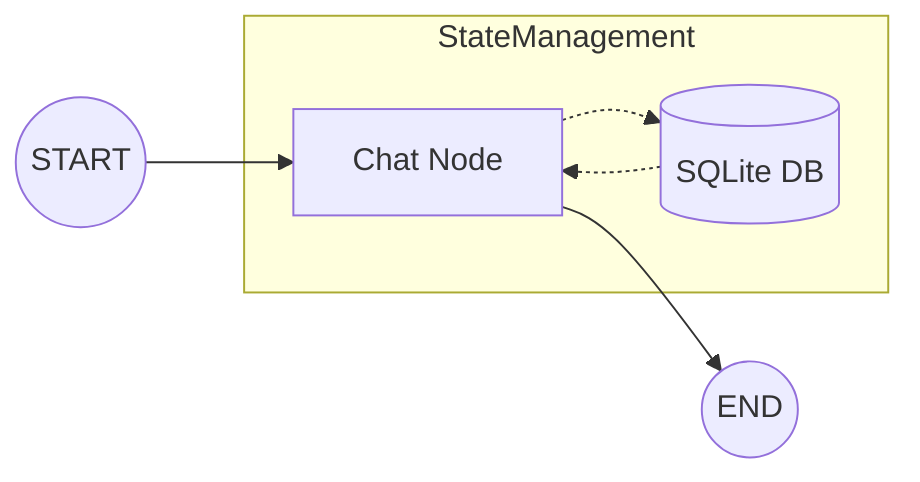

# 🤖 LangGraph Chatbot with Persistent Memory

A stateful AI chatbot built using **LangGraph**, **LangChain**, and **Streamlit**. This project demonstrates how to build a production-ready conversational agent that maintains long-term memory across multiple sessions using SQLite persistence.

## 🚀 Key Features

-   **Stateful Orchestration**: Built with `LangGraph` to manage conversation flow and state transitions.
-   **Persistent Storage**: Uses `SqliteSaver` to store conversation checkpoints, allowing users to resume chats even after a server restart.
-   **Real-time Streaming**: Implements token-by-token streaming using `st.write_stream` for a smooth, ChatGPT-like user experience.
-   **Multi-Thread Management**: Supports multiple independent conversation threads with a dedicated sidebar for navigation.
-   **Dynamic Chat Titles**: Automatically generates human-readable titles for chat sessions based on the initial user prompt.
-   **High Performance**: Powered by the `llama-3.1-8b-instant` model via Groq for ultra-fast inference.

## 🛠️ Technologies & Frameworks

| Category | Technology |
| :--- | :--- |
| **LLM Orchestration** | LangGraph |
| **LLM Framework** | LangChain |
| **Inference Engine** | Groq (Llama 3.1 8B) |
| **Frontend** | Streamlit |
| **Database** | SQLite (via `SqliteSaver`) |
| **Environment** | Python, Dotenv, Pydantic |

## 📐 Graph Architecture

The chatbot logic is structured as a state machine. This ensures that every interaction is tracked and can be resumed at any point.



1.  **START**: The graph receives the user input and the current `thread_id`.
2.  **Chat Node**: The LLM processes the message history (retrieved from SQLite) and generates a response.
3.  **Checkpointer**: The conversation state is automatically saved back to the SQLite database.
4.  **END**: The final response is returned to the Streamlit UI.

## 📁 Project Structure

-   `langgraph_database_backend.py`: The core logic. Defines the `StateGraph` and initializes the SQLite checkpointer.
-   `streamlit_frontend_database.py`: The main entry point. Handles the UI, sidebar logic, and session state.
-   `langgraph_backend.py`: A lightweight version of the backend using in-memory saving (`MemorySaver`).
-   `chatbot.db`: The SQLite database where all conversation history and threads are stored.

## 🏁 Getting Started

### Prerequisites
- Python 3.10+
- Groq API Key

### Installation

1. **Clone the repository:**
   ```bash
   git clone
   cd LangGraph-Chatbot
   ```

2. **Set up a virtual environment:**
   ```bash
   python -m venv .venv
   # Windows
   .\.venv\Scripts\activate
   # Mac/Linux
   source .venv/bin/activate
   ```

3. **Install dependencies:**
   ```bash
   pip install -r requirements.txt
   ```

4. **Configuration:**
   Create a `.env` file in the root directory and add your Groq API key:
   ```env
   GROQ_API_KEY=your_api_key_here
   ```

5. **Run the application:**
   ```bash
   streamlit run streamlit_frontend_database.py
   ```

## 🔮 Future Roadmap

-   [ ] **AI Title Generation**: Use the LLM to generate more descriptive 3-5 word titles for chats.
-   [ ] **Message Editing**: Allow users to edit previous messages and re-trigger the graph from that checkpoint.
-   [ ] **Export Chat**: Option to download conversation history as Markdown or PDF.
-   [ ] **Tool Integration**: Expand the graph to include search tools or data analysis nodes.

---
*Developed as part of the LangGraph Learning Path.*

---

Developed by **Ramandeep** 🚀